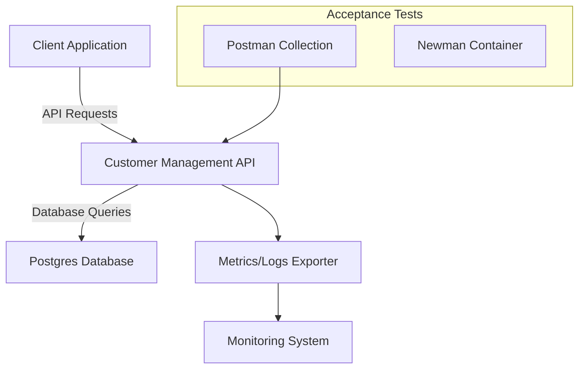
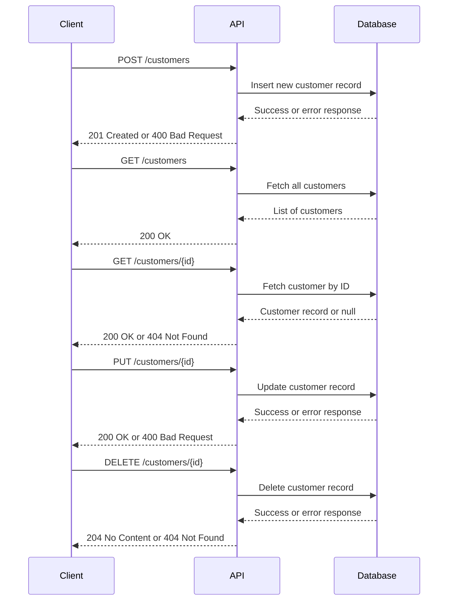

# Customer Management API

This project provides a RESTful API for managing customer data. It uses **Kotlin**, **Spring Boot**, **Postgres**, and **jOOQ** for type-safe database interactions. The API supports basic CRUD operations, along with validations, custom exception handling, and observability. It also includes automated acceptance testing, containerization for deployment, and instructions for Kubernetes integration.

**Key Features:**

- **Kotlin + Spring Boot**: Simple, concise, and robust backend.
- **Postgres + jOOQ**: Type-safe SQL queries and schema management.
- **Validation & Exceptions**: Constructor validation and custom HTTP responses.
- **Automated Tests**: Unit and acceptance tests (Postman + Newman).
- **Observability**: Integrated metrics and logs for better visibility.
- **CI/CD**: GitHub Actions pipeline on merges to `main`.
- **Containerization & Kubernetes**: Ready for Docker and K8s deployment.
- **Swagger/OpenAPI**: Interactive API docs locally and via GitHub Pages.

---

## Table of Contents

- [Architecture Overview](#architecture-overview)
- [Setup and Prerequisites](#setup-and-prerequisites)
- [Running the Application](#running-the-application)
- [API Documentation](#api-documentation)
- [Testing](#testing)
- [CI/CD and Deployment](#cicd-and-deployment)
- [Kubernetes](#kubernetes)
   - [Deploying Locally](#deploying-locally)
- [Contributing](#contributing)

---

## Architecture Overview



### Sequence Diagram



**Components:**

- **Client Application**: A CLI tool, frontend, or any HTTP client consuming the API.
- **Customer Management API**: Spring Boot application exposing CRUD endpoints.
- **Postgres Database**: Stores customer records. Interacted with via jOOQ.
- **Monitoring System**: Could be Prometheus/Grafana or external APM tools.
- **Tests**: Postman + Newman for end-to-end acceptance testing.

---

## Setup and Prerequisites

### Prerequisites

1. **Java 21+**: Install from [Amazon Corretto](https://aws.amazon.com/corretto/) or your package manager.
2. **Maven 3.8+**: Verify installation with `mvn -v`.
3. **Docker & Docker Compose**: For running Postgres and Newman tests easily.
4. **kubectl**: Command-line tool for Kubernetes.
5. **Minikube**: Local Kubernetes cluster for testing.

### Repository

Clone the repository:

```bash
git clone https://github.com/aaiezza/customer-management-api.git
cd customer-management-api
```

---

## Running the Application

### Local Development

Build the project:

```bash
mvn clean install
```

Run the application:

```bash
mvn spring-boot:run
```

The API is now available at: [http://localhost:8080](http://localhost:8080)

### Local Development with Docker Compose

Alternatively, you can use Docker Compose to run the application along with Postgres locally:

1. Ensure Docker is running.
2. Run the following command:

   ```bash
   docker-compose up app
   ```

This will build and run the Spring Boot application, as well as a Postgres database.

The API will be available at: [http://localhost:8080](http://localhost:8080)

### Local Kubernetes Deployment

Ensure **Minikube** and **kubectl** are installed and configured.

1. **Start Minikube:**
   ```bash
   minikube start --memory=6144 --cpus=4
   ```

2. **Run the Startup Script:**
   Execute the provided script to set up the project in Minikube:
   ```bash
   ./scripts/start-kubernetes.sh
   ```

3. **Access the Application:**
   Retrieve the Minikube service URL:
   ```bash
   minikube service customer-management-api --url
   ```

4. **Monitor Application Pods:**
   ```bash
   kubectl get pods --watch
   ```

5. **Shut Down the Environment:**
   To stop and clean up Minikube resources, run:
   ```bash
   ./scripts/shutdown-kubernetes.sh
   ```

---

## API Documentation

- **Swagger UI:** [View API Documentation](https://aaiezza.github.io/customer-management-api/docs/swagger/)

The Swagger UI provides an interactive interface for exploring and testing the API endpoints defined in the [OpenAPI Specification](docs/openapi.yaml).

### Swagger Generation Steps:

1. Install and run the `swaggerapi/swagger-ui` Docker container to serve your OpenAPI spec.
2. Extract Swagger static files:
   ```bash
   docker create --name swagger-ui-extract swaggerapi/swagger-ui
   docker cp swagger-ui-extract:/usr/share/nginx/html ./swagger-static
   docker rm swagger-ui-extract
   ```
3. Move `swagger-static` into `docs/swagger`:

```bash
mv swagger-static docs/swagger
```

4. Update `docs/swagger/swagger-initializer.js` to reference the OpenAPI spec:

```javascript
url: "../openapi.yaml"
```

5. Commit and push changes, then enable GitHub Pages to serve from the `docs` folder.

---

## jOOQ Code Generation

jOOQ generates type-safe database schema classes. To run the code generation:

   ```bash
   mvn clean install -Pjooq-codegen
   ```

This will generate the database schema classes in `target/generated-sources/jooq`.

---

## Testing

### Unit Tests

Run unit tests:

```bash
mvn test
```

### Acceptance Tests (Postman + Newman)

To simplify acceptance testing, you can leverage the provided `docker-compose` configuration to run Newman:

1. Ensure Docker is running.
2. Run the acceptance tests with:

   ```bash
   docker-compose up postman
   ```

This will execute the Postman collection against the running API and generate a report.

---

## CI/CD and Deployment

**GitHub Actions Workflow:**

- Set up a workflow in `.github/workflows/ci.yml` that triggers on merges to `main`.
   - Steps:
      1. Checkout code.
      2. Set up Java and build with Maven.
      3. Run unit and acceptance tests.
      4. Build and push Docker image to a registry.
      5. Deploy to test or prod environments if configured.

---

## Kubernetes

### Setting Up Secrets

Before running the project, create a `secrets.yaml` file for your credentials:

1. Copy `secrets.yaml.template` to `secrets.yaml`.
2. Replace `<base64-encoded-username>` and `<base64-encoded-token>` with your Base64-encoded Git credentials.
   - Use the following commands to encode your credentials:
     ```
     echo -n 'your-username' | base64
     echo -n 'your-token' | base64
     ```
3. Save the file in the same directory as the template.

**Important**: Do not commit `secrets.yaml` to the repository. It is excluded by `.gitignore`.

### Deploying Locally

1. **Start Minikube:**
   ```bash
   minikube start --memory=6144 --cpus=4
   ```

2. **Run the Startup Script:**
   ```bash
   ./scripts/start-kubernetes.sh
   ```

3. **Monitor Application Status:**
   ```bash
   kubectl get pods
   ```

4. **Access the Service:**
   ```bash
   minikube service customer-management-api
   ```

5. **Shut Down the Environment:**
   ```bash
   ./scripts/shutdown-kubernetes.sh
   ```

---

## Contributing

1. Fork the repository and create a feature branch.
2. Commit changes with descriptive messages.
3. Open a Pull Request against `main`.
4. Contributions are welcomed and reviewed promptly.
