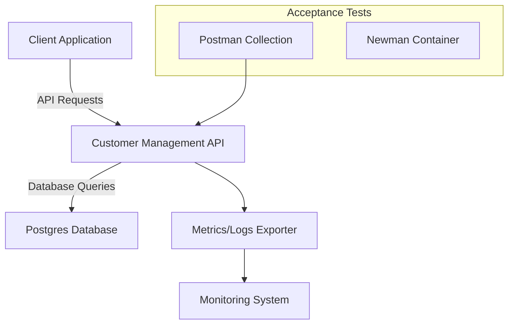
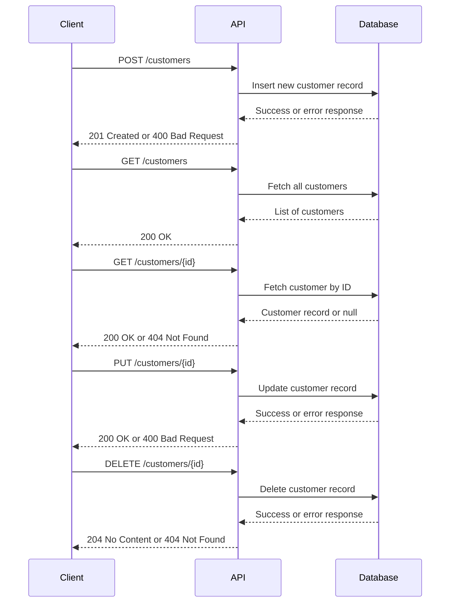

# Customer Management API

This project provides a RESTful API for managing customer data. It uses **Kotlin**, **Spring Boot**, **Postgres**, and **jOOQ** for type-safe database interactions. The API supports basic CRUD operations, along with validations, custom exception handling, and observability. It also includes automated acceptance testing, containerization for deployment, and instructions for Kubernetes integration.

**Key Features:**
- **Kotlin + Spring Boot**: Simple, concise, and robust backend.
- **Postgres + jOOQ**: Type-safe SQL queries and schema management.
- **Validation & Exceptions**: Constructor validation and custom HTTP responses.
- **Automated Tests**: Unit and acceptance tests (Postman + Newman).
- **Observability**: Integrated metrics and logs for better visibility.
- **CI/CD**: GitHub Actions pipeline on merges to `main`.
- **Containerization & Kubernetes**: Ready for Docker and K8s deployment.
- **Swagger/OpenAPI**: Interactive API docs locally and via GitHub Pages.

---

## Table of Contents
- [Architecture Overview](#architecture-overview)
- [Setup and Prerequisites](#setup-and-prerequisites)
- [Database Configuration](#database-configuration)
- [Running the Application](#running-the-application)
- [Usage](#usage)
- [API Documentation](#api-documentation)
- [Testing](#testing)
- [CI/CD and Deployment](#cicd-and-deployment)
- [Kubernetes](#kubernetes)
- [Contributing](#contributing)

---

## Architecture Overview



### Sequence Diagram




**Components:**
- **Client Application**: A CLI tool, frontend, or any HTTP client consuming the API.
- **Customer Management API**: Spring Boot application exposing CRUD endpoints.
- **Postgres Database**: Stores customer records. Interacted with via jOOQ.
- **Monitoring System**: Could be Prometheus/Grafana or external APM tools.
- **Tests**: Postman + Newman for end-to-end acceptance testing.

---

## Setup and Prerequisites

### Prerequisites
1. **Java 21+**: Install from [Amazon Corretto](https://aws.amazon.com/corretto/) or your package manager.
2. **Maven 3.8+**: Verify installation with `mvn -v`.
3. **Docker & Docker Compose**: For running Postgres and Newman tests easily.
4. **Postgres**: Run locally or via Docker.

### Repository
Clone the repository:
```bash
git clone https://github.com/your-username/customer-management-api.git
cd customer-management-api
```

---

## Database Configuration

A sample `docker-compose.yml` for Postgres:
```yaml
version: '3.9'
services:
  db:
    image: postgres:14-alpine
    container_name: customer_db
    environment:
      POSTGRES_USER: customer_user
      POSTGRES_PASSWORD: customer_pass
      POSTGRES_DB: customer_db
    ports:
      - "5432:5432"
    healthcheck:
      test: ["CMD-SHELL", "pg_isready -U customer_user -d customer_db"]
      interval: 5s
      timeout: 5s
      retries: 5
```

Start the database:
```bash
docker-compose up -d
```

Environment Variables (in `.env` or your environment):
```env
DATABASE_URL=jdbc:postgresql://localhost:5432/customer_db
DATABASE_USER=customer_user
DATABASE_PASSWORD=customer_pass
```

---

## Running the Application

Build the project:
```bash
mvn clean install
```

Run the application:
```bash
mvn spring-boot:run
```

The API is now available at: [http://localhost:8080](http://localhost:8080)

To containerize:
```bash
docker build -t your-username/customer-management-api .
docker run -p 8080:8080 --env-file .env your-username/customer-management-api
```

---

## Usage

**Endpoints:**
- **Create a Customer**: `POST /customers`
- **List Customers**: `GET /customers`
- **Get Customer by ID**: `GET /customers/{id}`
- **Update a Customer**: `PUT /customers/{id}`
- **Delete a Customer**: `DELETE /customers/{id}`

Use `curl`, Postman, or any HTTP client to interact with the API.

---

## API Documentation

### Local Swagger UI
Once running locally:
- **Swagger UI**: [http://localhost:8080/swagger-ui.html](http://localhost:8080/swagger-ui.html)
- **OpenAPI Spec**: [http://localhost:8080/v3/api-docs](http://localhost:8080/v3/api-docs)

### Hosting Swagger UI on GitHub Pages
1. Generate a static site from the OpenAPI spec (e.g., using Swagger Codegen).
2. Place the generated files in a `docs/` folder at the repository root.
3. Enable GitHub Pages in the repository settings, pointing to `docs/`.
4. Update this README with:
   ```markdown
   **Interactive Swagger UI (GitHub Pages)**: [https://your-username.github.io/customer-management-api](https://your-username.github.io/customer-management-api)
   ```

---

## Testing

1. **Unit Tests**:
   ```bash
   mvn test
   ```

2. **Acceptance Tests (Postman + Newman)**:
    - Ensure `postman/collection.json` is available.
    - Run with Newman:
      ```bash
      docker run -v $(pwd)/postman:/etc/newman postman/newman run /etc/newman/collection.json
      ```

---

## CI/CD and Deployment

**GitHub Actions Workflow:**
- Set up a workflow in `.github/workflows/ci.yml` that triggers on merges to `main`.
- Steps:
    1. Checkout code.
    2. Set up Java and build with Maven.
    3. Run unit and acceptance tests.
    4. Build and push Docker image to a registry.
    5. Deploy to test or prod environments if configured.

---

## Kubernetes

To deploy to Kubernetes:
1. Create `deployment.yaml` and `service.yaml` in `k8s/`:
   ```yaml
   apiVersion: apps/v1
   kind: Deployment
   metadata:
     name: customer-management-api
   spec:
     replicas: 2
     selector:
       matchLabels:
         app: customer-management-api
     template:
       metadata:
         labels:
           app: customer-management-api
       spec:
         containers:
         - name: customer-management-api
           image: your-username/customer-management-api:latest
           ports:
           - containerPort: 8080
   ```

2. Deploy:
   ```bash
   kubectl apply -f k8s/
   ```

3. Access the application via `kubectl port-forward` or a LoadBalancer/Ingress.

---

## Contributing

1. Fork the repository and create a feature branch.
2. Commit changes with descriptive messages.
3. Open a Pull Request against `main`.
4. Contributions are welcomed and reviewed promptly.
